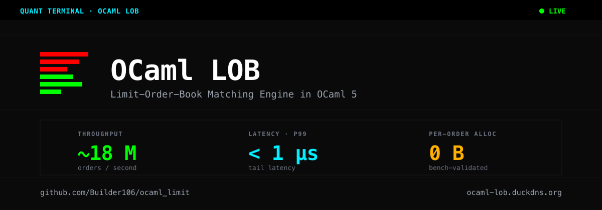
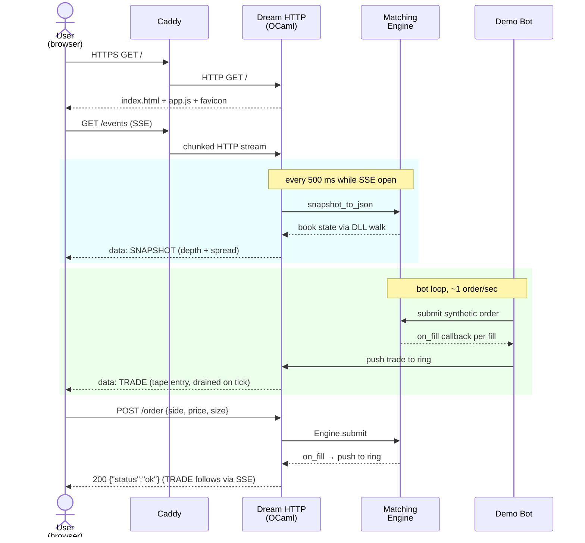
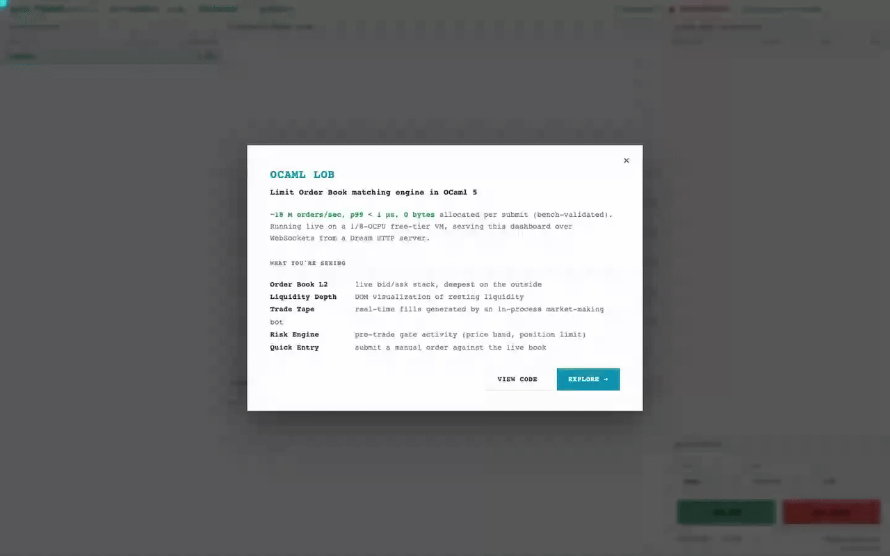
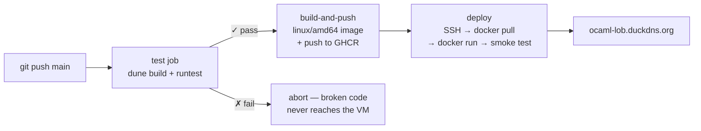

<picture>
  <source media="(prefers-color-scheme: dark)" srcset="assets/banner-dark.png">
  <source media="(prefers-color-scheme: light)" srcset="assets/banner-light.png">
  
</picture>

# OCaml LOB

[](https://github.com/Builder106/ocaml-limit/actions/workflows/deploy.yml)
[](#license)
[](https://ocaml.org/)
[](https://aantron.github.io/dream/)
[](https://tailwindcss.com/)
[](https://www.chartjs.org/)
[](https://www.docker.com/)
[](https://playwright.dev/)
[](https://caddyserver.com/)
[](https://www.oracle.com/cloud/)
[](https://ocaml-lob.vercel.app/)

A high-performance **limit-order-book matching engine in OCaml 5**, with a Dream HTTP + Server-Sent-Events server and a Bloomberg-terminal–styled browser dashboard. The matching hot path is **allocation-free per submit**(bench-validated), achieves**~18 M orders/sec**in the clean perf test, and holds**p99 latency under 1 μs**.

🟢 **Live demo:** [ocaml-lob.vercel.app](https://ocaml-lob.vercel.app/) — dashboard on Vercel, matching engine on a free-tier Oracle Cloud VM. Click the (i) in the top right for an in-app tour.

---

## What is this

A working approximation of an exchange-grade matching engine, built for performance learning + a recruiter-facing portfolio piece. The engine implements price-time priority matching with iceberg orders, post-only rejection, IOC (Immediate-Or-Cancel), FOK (Fill-Or-Kill), and pre-trade risk gates; the front-end visualizes a live book updating in real time.

The API is small enough to fit on a postcard:

```ocaml
open Ocaml_lob.Types
module Engine = Ocaml_lob.Engine

let engine = Engine.create default_config in
let order  = make_order ~id:1 ~side:Buy ~price:1_502_500 ~qty:100
               ~order_type:Limit ~timestamp:0 in

match Engine.submit engine order (fun passive_id active_id price qty _ts ->
        Printf.printf "fill: %d×%d @ %d (passive=%d active=%d)\n"
          qty 1 price passive_id active_id)
with
| Ok ()   -> () (*order accepted*)
| Error _ -> () (*pre-trade risk rejected*)
```

Six layered optimizations got the hot path from ~16 bytes/order down to **0.0033 bytes/order**:

1. Pre-allocated result-wrapper constants (no `Ok ()` boxing per submit)
2. `PriceMap.find`+`exception Not_found`instead of`find_opt`(no`Some` boxing)
3. Top-level `fill_loop` (no per-submit closure allocation)
4. Intrusive doubly-linked list of price levels (no `max_binding_opt` tuple boxing)
5. Lazy-keep on level exhaustion + resurrection promotion (no `PriceMap.remove` tree-spine rebuild)
6. Custom open-addressing hashtable replacing stdlib `Map.Make(Int)` (no per-insert tree-spine rebuild)

Full architectural deep-dive in [ONBOARDING.md](ONBOARDING.md).

---

## Architecture (user flow)



Caddy on the host handles TLS. The OCaml binary inside the container handles everything else. SSE replaced an earlier WebSocket transport after `gluten_lwt`'s WS close path was found to wedge the event loop in a tight retry-on-failed-write cycle (see commit `0c62bc0`).

---

## Features

Demo videos below were recorded with Playwright + the project's local E2E suite. Each one shows a single user flow end-to-end so you can see the dashboard behaving live.

<details>
<summary><strong>Live order book + depth chart + trade tape</strong></summary>

<picture>
  <source media="(prefers-color-scheme: dark)" srcset="assets/demos/01-core-dark.gif">
  
</picture>

The dashboard streams L2 book snapshots every 500 ms over Server-Sent Events. The depth chart on the center pane visualizes resting liquidity; the trade tape on the right shows every fill the engine produces (both from the in-process demo bot and from manual orders).

</details>

<details>
<summary><strong>Manual order entry with live risk feedback</strong></summary>

<picture>
  <source media="(prefers-color-scheme: dark)" srcset="assets/demos/02-manual-entry-dark.gif">
  
</picture>

The Quick Entry panel POSTs orders straight into the running engine. Rejected orders surface in the Risk Engine Activity log on the left.

</details>

<details>
<summary><strong>First-visit onboarding modal</strong></summary>

<picture>
  <source media="(prefers-color-scheme: dark)" srcset="assets/demos/04-onboarding-dark.gif">
  
</picture>

Auto-opens on first visit with the headline numbers and a panel-by-panel guide. Dismissal persists in `localStorage`; the (i) icon in the header re-opens it.

</details>

> **For maintainers:** recording flow — `npm --prefix e2e run demo`records mp4s at 1440×900 into`e2e/demo-output/`, then `npm --prefix e2e run gifs`converts them to 1280px-wide GIFs in`assets/demos/`. Every feature has a `-light`and`-dark`variant; the README embeds them via`<picture media="(prefers-color-scheme: dark)">` so the active gif follows the reader's browser theme. Recorded close to the README's display resolution so the GIFs are crisp on Retina without blowing GitHub's 10 MB inline-image cap.

---

## Try it locally

Prerequisites: opam 2.x with an OCaml 5.x switch active.

```bash
opam install --deps-only --with-test -y .   # alcotest + transitive
opam install -y dream yojson lwt_ppx        # server-only deps
dune build                                   # compile everything
dune runtest                                 # 11 tests across matching + perf
dune exec bin/server.exe                     # serves on localhost:8080
dune exec bin/bench.exe                      # 1M-order benchmark with allocation report
dune exec bin/diag.exe                       # bytes/order at varying scales
```

Open `http://localhost:8080/`. The demo bot starts automatically.

For deploying to your own VM (Oracle Cloud Always-Free walkthrough), see [DEPLOY.md](DEPLOY.md).

---

## CI/CD pipeline

[.github/workflows/deploy.yml](.github/workflows/deploy.yml) wires up CI + CD on every push to `main`.



**Sequential gating**: the build job has `needs: test`, so a single Alcotest failure prevents the image from being built — let alone pushed or deployed. The deploy job has `needs: build-and-push`, so an image that fails to build never reaches the VM. Concurrency-gated (`group: deploy-prod`) so two simultaneous pushes can't race on the host.

**Caching**: `ocaml/setup-ocaml@v3`caches the opam switch (~2 min cache-warm vs ~8 min cold). Docker layers cache via`cache-from: type=gha`, so source-only changes rebuild the image in ~1.5 min.

**Secrets** (`SSH_HOST`, `SSH_USER`, `SSH_PRIVATE_KEY`) are resolved at workflow start time and used by `appleboy/ssh-action` to reach the VM. Setup walkthrough in DEPLOY.md.

---

## Test suite

Two Alcotest files under [test/](test/), 11 cases total. Runs in well under a second.

| Group | Test | What it pins |
| --- | --- | --- |
| `matching` | Basic matching | Same-price Buy/Ask filling each other |
| `matching` | Iceberg reload | Visible-portion exhausts, hidden portion reloads at the queue tail; total qty conserved |
| `matching` | Post-only rejection | Crossing post-only returns`Reject_price_band` |
| `matching` | Cancel preserves FIFO | Canceling a mid-queue order leaves FIFO linkage intact across the gap |
| `matching` | Sweep across levels | Aggressive order eating partial fills across 3 price levels with correct`pl_total_qty` |
| `matching` | Level resurrection | Empty level + new order at same price re-promotes`best_level` |
| `messaging` | MPSC FIFO (1 producer) | Single-producer/consumer round-trip preserves order |
| `messaging` | MPSC FIFO (4 domains) | 4 OCaml Domains push concurrently; per-producer FIFO holds across 1000 messages |
| `regression` | Zero per-order allocation | `≤ 0.20 bytes/order` over 100k submits (measured: ~0.06) |
| `regression` | Throughput floor | `≥ 0.5 M orders/sec` (measured: ~30+) |
| `regression` | p99 latency ceiling | `≤ 100 μs` (measured: ~1 μs) |

The two matching cases that originally surfaced as test failures (`Sweep across levels`and`Level resurrection`) caught a real production bug — an OCaml scope gotcha where `else let … in …; stmt; stmt;`silently extended into following statements, dropping`pl_total_qty`and the resurrection check on the`tail_idx = -1` code path. Fix shipped; the tests stay as regression sentinels.

---

## Project layout

```text
ocaml_lob/
├── lib/                           engine + types + custom data structures
│   ├── types.ml                   price_level, book_side, sentinel_level
│   ├── engine.ml                  submit, fill_loop, link_level
│   ├── price_index.ml             open-addressing hashtable replacing stdlib Map
│   ├── pool.ml                    pre-allocated order pool
│   ├── risk.ml                    pre-trade gates (variant returns, no exns)
│   ├── stats.ml                   nanosecond latency tracker
│   └── messaging.ml               OCaml 5 atomic MPSC queue
├── bin/
│   ├── server.ml                  Dream HTTP: GET /events (SSE), POST /order, demo bot
│   ├── bench.ml                   1M-order benchmark, prints throughput + alloc
│   └── diag.ml                    raw bytes/order measurement via Gc.minor_words
├── test/
│   ├── test_engine.ml             matching + messaging cases
│   └── perf_test.ml               regression guards
├── front/                         dashboard (vanilla JS + Tailwind CDN + Chart.js)
├── assets/                        repo-only banner artwork
├── Dockerfile                     multi-stage: ocaml/opam → ubuntu:22.04
├── DEPLOY.md                      Oracle Cloud E2.1.Micro walkthrough
├── ONBOARDING.md                  architecture deep-dive for new contributors
└── .github/workflows/deploy.yml   CI (test) + CD (build + ship)
```

---

## Documentation

- **[ONBOARDING.md](ONBOARDING.md)** — full architecture, the six perf fixes explained, known gotchas, hang runbook

## License

MIT. See [`ocaml_lob.opam`](ocaml_lob.opam) for full package metadata.
